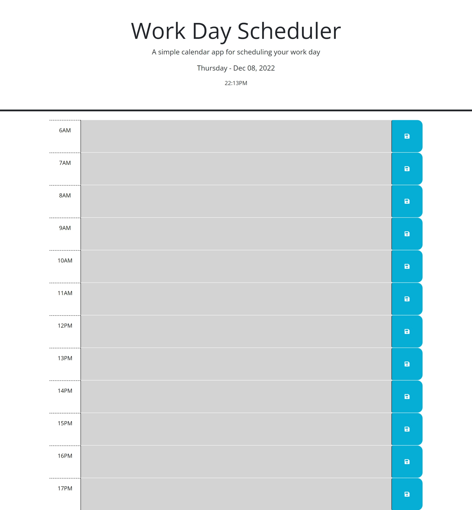

# EZ-Scheduler

## Description

This webpage was made using HTML, CSS, and Javascript. The purpose of this webpage is to allow users to input daily tasks into a hourly schedule that indicates present past and future "TO-DO's.The color scheme indicates that gray is hours that have past, red is the current hour and green is future hours.

## Installation

N/A

## Usage

To use this page, the user can press on any hour displayed and enter Text in any time slot. By pressing on the floppy-disk emoji, the text will be saved in local storage and will continue to populate that text area until the user deletes or replaces the text with new text. 
   

## Credits

N/A

## License

N/A